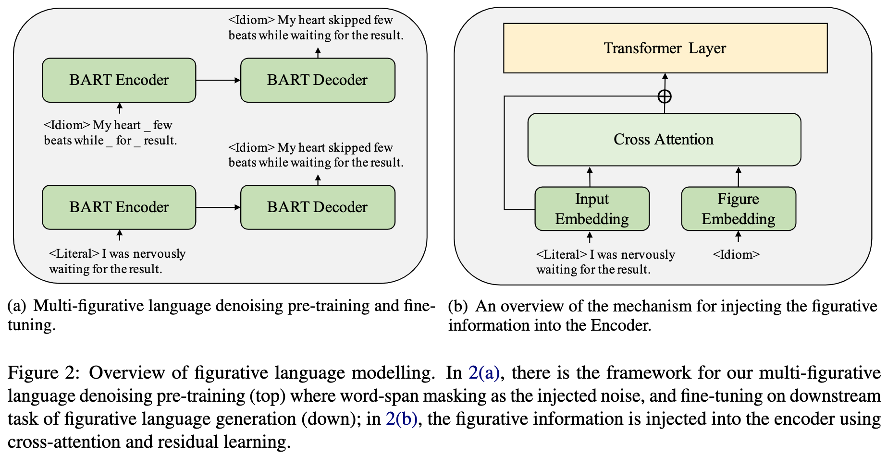

# Multi-Figurative Language Generation 

code coming soon.

## Overview



## Dataset
- [multi-fig](): literal (0) <-> figure (1), e.g. train_hypebole.0 <-> train_hyperbole.1.

## Quick Start
### Step 1: Pre-training
```bash
python train_pt.py -dataset parap-fig -figs hyperbole idiom irony metaphor simile
```

### Step 2: Fine-tuning
```bash
# parallel paraphrase pretraining data
python train_ft.py -dataset parap-fig -figs hyperbole idiom irony metaphor simile

# literal-figurative parallel data
python train_ft.py -dataset multi-fig -figs hyperbole idiom irony metaphor simile
```

### Step 3: Figurative Generation
```bash
python inference.py -src_form hyperbole -tgt_form idiom
```
